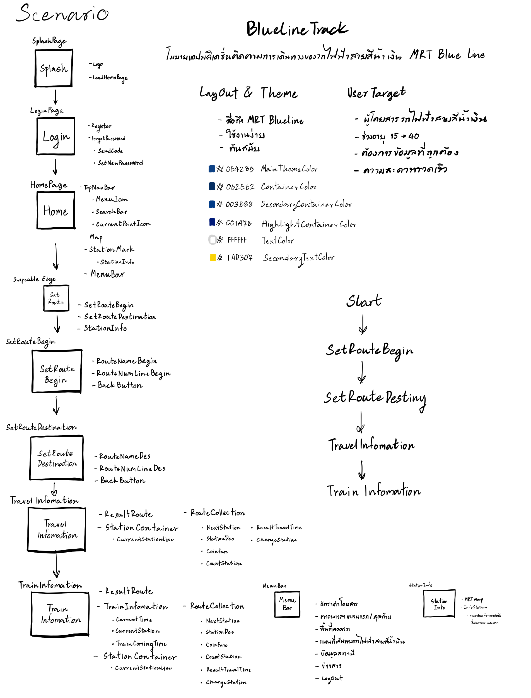
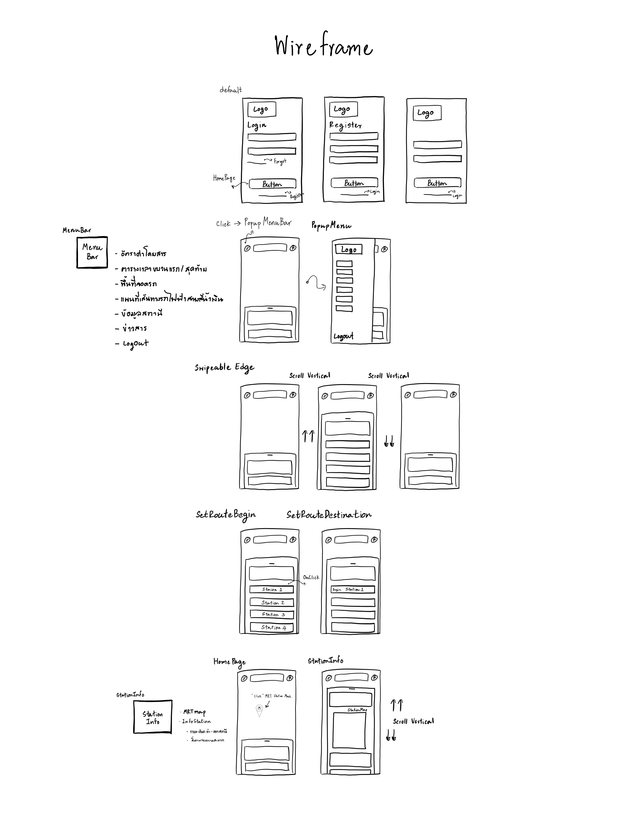

# โมบายแอปพลิเคชั่นติดตามการเดินทางของรถไฟฟ้าสายสีน้ำเงิน BlueLineTrack

## 5.ออกแบบ Project ตามที่ให้โจทย์ไปบน โปรแกรม Figma 
Device Prototype ใช้เป็น iPhone13 mini Resulution 2340×1080 pixels 

[Figma Design Tasks](https://www.figma.com/file/Yhdd7GJlUwXJYk6gXnBcPd/UX%2FUI-Design?type=design&node-id=2127%3A13194&mode=design&t=JkknzLF8dgAvHHuF-1)

## ปัญหา

ปัจจุบันแอปพลิเคชั่น "Bangkok MRT" ที่พัฒนาโดย BEM มีปัญหาที่เกี่ยวกับ UI ที่ไม่ครอบคลุมหรือรองรับกับความต้องการของผู้ใช้ในปัจจุบันจึงได้หยิบยกกรณี Bangkok MRT มา Redesign 

## เป้าหมาย

เป้าหมายของโปรเจกต์นี้คือการพัฒนาแอปพลิเคชั่นที่ให้ข้อมูลที่สำคัญต่อการเดินทางของผู้ใช้ ดังนี้:
- ข้อมูลการเดินทางจากสถานีต้นทาง-ปลายทาง
- คำนวณราคาตั๋ว
- จำนวนสถานีที่ใช้เดินทาง
- เวลาที่ใช้ในการเดินทาง
- จุดเปลี่ยนสถานี
- ข้อมูลของแต่ละสถานี
- เวลาที่รถไฟฟ้ากำลังจะมาถึง
- UI ที่แสดงตำแหน่งสถานีของผู้ใช้
- ข้อมูลพื้นฐานอื่น ๆ

## User Target

- ผู้โดยสารรถไฟฟ้าสายสีน้ำเงิน
- ช่วงอายุ 15-40 ปี
- ต้องการข้อมูลที่ถูกต้องน่าอ่าน
- ต้องการความสะดวกรวดเร็วในการใช้งาน

## Design System & Theme

- สีหลัก: #0E4285 (Main Theme Color)
- สีพื้นหลัก: #062E62 (Container Color)
- สีพื้นรอง: #003B88 (Secondary Container Color)
- สีพื้นสำคัญ: #001A78 (Highlight Container Color)
- สีข้อความ: #FFFFFF (Text Color)
- สีข้อความรอง: #FAD307 (Secondary Text Color)

## Scenario

## WireFrame

